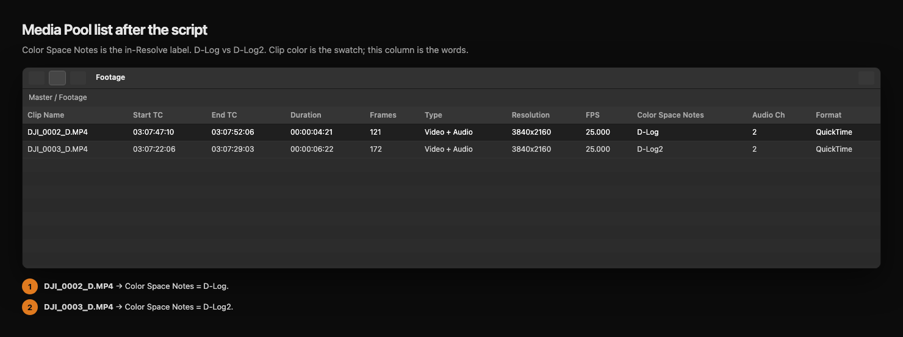

# DJI Clip Color

[](LICENSE)
[](https://github.com/erik-sutton95/dji-clip-color/actions/workflows/test.yml)

**Show D-Log vs D-Log2 on DJI clips in DaVinci Resolve.**

Resolve reads DJI takes as Rec.709 even when you shot log. The camera hides the
real profile in a Keys field (`com.dji.camera.ColorGammaSxS` /
`DjiCameraColorGammaSxS`) that Resolve never maps.

Select clips → run the script → the Media Pool shows **D-Log2**, **D-Log**,
**D-Log M**, **HLG**, or **Rec.709**. Log clips also get a clip color.


| Shot color | Clip color |
| --- | --- |
| D-Log2 | Orange |
| D-Log | Navy |
| D-Log M | Pink |
| Rec.2100 HLG | Teal |
| Rec.709 | metadata only |

Orange vs navy so a mixed bin is obvious at thumbnail size.



## Install

**Mac** (double-click `install.command` after unzipping, or):

```bash
curl -fsSL https://raw.githubusercontent.com/erik-sutton95/dji-clip-color/main/install.sh | bash
```

**Windows** (double-click `install.bat` after unzipping, or PowerShell):

```powershell
irm https://raw.githubusercontent.com/erik-sutton95/dji-clip-color/main/install.ps1 | iex
```

Restart Resolve if it is already open.

**Windows:** Resolve will not list this script until **64-bit Python 3** is
installed (python.org, add to PATH). If **Workspace → Scripts** is empty after
a restart, see
[Troubleshooting](docs/user-guide.md#troubleshooting).

Step-by-step, skipped-clip table, and uninstall: **[user guide](docs/user-guide.md)**.

## Use

1. Import **original** MP4 / MOV takes (not `.LRF` / `.XRF` / `.LRV` proxies).
2. Select them in the Media Pool.
3. **Workspace → Scripts → DJI Clip Color**.
4. Show the **D-Log / D-Log2** text in the list: Media Pool **list view** →
   Customize Columns → search **`notes`** or **`keyword`** (not `dji`) → add
   **Color Space Notes** or **Keywords** → Save. There is no DJI Color column.
   Clip color (orange / navy) shows without this. Full clicks:
   [user guide](docs/user-guide.md#show-d-log--d-log2-in-the-media-pool-list).
5. After the run, glance at **File → Project Settings → Color Management**
   and put it back if it moved. Tagging Input Color Space on the clips can
   change the project setup (see below).

## Input Color Space / Gamma

The script sets **Input Color Space** (and Input Gamma where Resolve has one)
on every selected clip to the matching DJI option. That is what Resolve Color
Managed needs. A **node-based** workflow (CST on the first node) does not need
those clip tags — you already define the space in the node tree.

Resolve only accepts those clip writes while Color Science is Color Managed, so
the script may **change your project Color Management**. Typical leftovers:

- **Use separate color space and gamma** turns on (node-based YRGB included).
- Timeline gamma can split, e.g. DaVinci WG/Intermediate → DaVinci WG + Rec.709.
- Automatic color management can split **Output color space** into two menus.

After you run it, open **File → Project Settings → Color Management** and put
the project back how you like it. Clip colors, Color Space Notes, and grades
stay.

| Shot color | Input Color Space | Input Gamma |
| --- | --- | --- |
| D-Log | DJI D-Gamut | DJI D-Log |
| Rec.2100 HLG | Rec.2020 | Rec.2100 HLG |
| Rec.709 | Rec.709 | Rec.709 |
| D-Log M | Rec.709 | Rec.709 |
| D-Log2 | DJI D-Gamut | Rec.709 |

Resolve has **no official profile for D-Log2 or D-Log M** (DJI has not
published a white paper for either). D-Log2 is tagged D-Gamut + Rec.709 gamma,
not DJI D-Log. D-Log M is tagged Rec.709. Use a LUT for those.

## Probe a file

```bash
python3 dji_clip_color.py clip.MP4
```

## Contributing

PRs welcome. Tests: `python3 -m unittest discover -s tests -v`. See
[CONTRIBUTING.md](CONTRIBUTING.md).

## License

Copyright 2026 Erik Sutton. Licensed under the
[Apache License 2.0](LICENSE).

Parser ported from
[OpenPocketCine](https://github.com/erik-sutton95/OpenPocketCine) `ClipColorProfile`
(Apache-2.0).

If this saved you a bin-sort, [buy me a coffee](https://buymeacoffee.com/eriksutton) — optional, helps keep the lights on.
