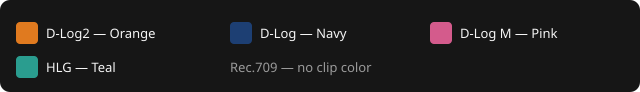

# DJI Clip Color — user guide

DaVinci Resolve does not show whether a DJI take is Rec.709, D-Log, or D-Log2.
The camera writes Rec.709 into the standard color box even when you shot log.
The real profile lives in a DJI Keys field Resolve never maps.

This script reads that field and stamps it onto the clips you select.

## Install

### Mac

**Double-click:** download the repo ZIP (GitHub → Code → Download ZIP), unzip,
then double-click `install.command`. macOS may ask you to allow it: right-click
the file → Open → Open.

**Terminal, no download:**

```bash
curl -fsSL https://raw.githubusercontent.com/erik-sutton95/dji-clip-color/main/install.sh | bash
```

The installer copies `DJI Clip Color.py` into Resolve’s Utility scripts folder
and reveals it in Finder.

### Windows

**Double-click:** unzip the repo and double-click `install.bat`. If SmartScreen
warns, choose More info → Run anyway.

**PowerShell, no download:**

```powershell
irm https://raw.githubusercontent.com/erik-sutton95/dji-clip-color/main/install.ps1 | iex
```

The installer copies the script into:

`%APPDATA%\Blackmagic Design\DaVinci Resolve\Support\Fusion\Scripts\Utility\`

and opens that folder in Explorer.

Restart Resolve if it was already running. The menu item only appears after a
restart.

## First run

1. Import the **original** camera files (`.MP4` / `.MOV` from `DCIM`).
   Do not use the phone proxy (`.LRF` / `.XRF` / `.LRV`) — those are Rec.709
   even when the original is log.
2. In the **Media Pool**, select the clips.
3. **Workspace → Scripts → DJI Clip Color**.
4. Show the **D-Log / D-Log2** text next to clip colors (see below).

A short report lists how many clips were D-Log2, D-Log, HLG, or Rec.709, and
any skips.

## Show D-Log / D-Log2 in the Media Pool list

Clip color (orange / navy) is enough to spot log at a glance. For the actual
words **D-Log** and **D-Log2** in a column, use a **built-in** field. There is
no **DJI Color** entry in Customize Columns — searching `dji` will stay empty.

The script writes the label to **Color Space Notes** and **Keywords**.

1. In the Media Pool, switch to **list view** (the list icon, not thumbnails).
2. Open **Customize Columns**:
   - click the column-layout control above the list, or
   - right-click any column header (Clip Name, File Path, …).
3. In the search box at the top, type **`notes`** or **`keyword`** — not `dji`.
4. From **Column Fields**, add:
   - **Color Space Notes** (best: it is only this label), or
   - **Keywords** (same text, appended to any keywords you already had).
5. Click **Save**.

Run the script **before** you expect text in the column. Empty cells mean those
clips have not been stamped yet. Select them and run **Workspace → Scripts →
DJI Clip Color** again.

You can also add **Input Color Space** and **Input Gamma** the same way
(search `input`) if you want the RCM fields in the list.

## Clip colors



| Shot color | Clip color | Why |
| --- | --- | --- |
| D-Log2 | **Orange** | Warm tag — easy to spot in a mixed bin |
| D-Log | **Navy** | Cool tag, opposite of orange |
| D-Log M | **Pink** | Action / Nano family |
| Rec.2100 HLG | **Teal** | HDR |
| Rec.709 | none | Tagged in **DJI Color** only, so a color you already set is left alone |

Orange vs navy is deliberate. Yellow next to orange was too close to read at
thumbnail size.

## If a clip is skipped

| Message | What to do |
| --- | --- |
| proxy sidecar | Import the original `.MP4` / `.MOV`, not the LRF/XRF |
| file not found | Relink the media; the script reads the file on disk |
| no ColorGammaSxS | Use the camera original. Some Mimo “share” exports strip Keys |
| Select clips… | Highlight clips in the Media Pool, then run the script again |

## Input Color Space / Gamma

The script also sets each clip’s Input Color Space and Input Gamma (same as
right-click → Input Color Space in the Media Pool). Resolve only accepts that
write while Color Science is Color Managed. If the project is plain DaVinci
YRGB, the script flips Color Managed on for the write, then restores YRGB —
the Input Color Space value stays.

| Shot color | Input Color Space | Input Gamma |
| --- | --- | --- |
| D-Log | DJI D-Gamut | DJI D-Log |
| Rec.2100 HLG | Rec.2020 | Rec.2100 HLG |
| Rec.709 | Rec.709 | Rec.709 |
| D-Log M | Rec.709 | Rec.709 |
| D-Log2 | DJI D-Gamut | Rec.709 |

**D-Log2:** Resolve 21 has no D-Log2 gamma. Color space is **DJI D-Gamut**;
gamma stays **Rec.709** (not DJI D-Log). They stay orange in the bin so you
can drop a D-Log2 LUT. The inspector may still print Input Color Space as
`DJI D-Gamut/D-Log` — that is Resolve’s IDT name; check Input Gamma to tell
D-Log (`DJI D-Log`) from D-Log2 (`Rec.709`).

**D-Log M** is not DJI D-Log. It is tagged Rec.709.

If the project is still DaVinci YRGB (unmanaged), the report will warn that
Input Color Space / Gamma did not apply. Turn on Color Managed and run again.

On Resolve 18 and older there is no custom-column API, so the DJI Color value
is written to **Keywords** instead.

## Uninstall

Mac / Linux: `./uninstall.sh`

Windows: double-click `uninstall.bat`

## Probe a file without Resolve

```bash
python3 dji_clip_color.py "/path/to/clip.MP4"
```

```
clip.MP4    D-Log2
```

That is the same tag ExifTool prints as `Keys:DjiCameraColorGammaSxS`.

---

If this saved you a bin-sort, [buy me a coffee](https://buymeacoffee.com/eriksutton) — optional, helps keep the lights on.
